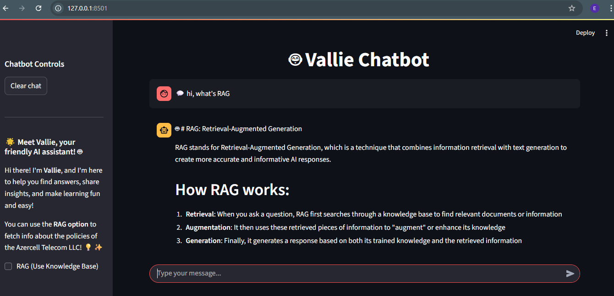
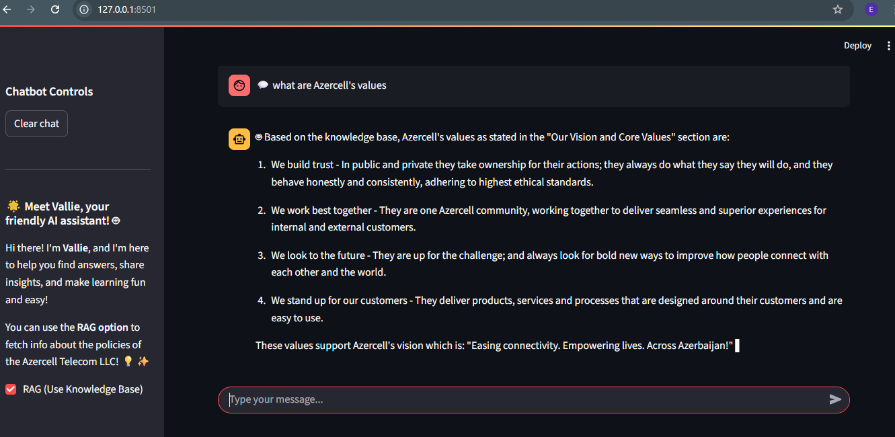

# RAG-based AI Chatbot

[](https://github.com/elnama17/rag-ai-chatbot/actions/workflows/ci-build.yaml)

[](https://opensource.org/licenses/Apache-2.0)
[](https://shields.io/)

---

## 🤖 Vallie: Friendly RAG-based AI Chatbot

Vallie is a friendly AI assistant powered by Amazon Bedrock LLM and optionally enhanced with RAG (Retrieval-Augmented Generation). Vallie can answer questions, provide insights, and fetch specific company knowledge when RAG is enabled.

### ✨ Features
- Conversational AI with a friendly personality (**Vallie**).  
- Real-time **streaming responses** from the backend.  
- Optional **RAG functionality** to retrieve information from a knowledge base.  
- Dockerized **frontend (Streamlit)** and **backend (FastAPI)** services.

## Query without RAG


## Query with RAG




## project structure
```
------------
rag-ai-chatbot/
│
├── .github/
│   └── workflows/
│       └── ci-build.yaml
│
├── backend/
│   ├── assets/
│   │   ├── endpoints.png
|   |   ├── logs.png
│   │   └── backend_logs.png
│   ├── app.py
│   ├── Dockerfile
│   ├── pyproject.toml
│   ├── requirements.txt
│   ├── .python-version
|   └── uv.lock
│
├── frontend/
│   ├── assets/
│   │   ├── vallie_llm_answer.png
│   │   └── rag_version.png
│   ├── app.py
│   ├── Dockerfile
│   ├── pyproject.toml
│   ├── requirements.txt
|   ├── uv.lock
│   └── .python-version
├─ .gitignore
├─ LICENSE
├─ README.md
└─ docker-compose.yml

--------
```

---

## ⚙️ Requirements

Before running the project, make sure you have the following installed:

- Python 3.9+

- uv (for dependency management and running the app)

- Docker

## 🚀 Setup & Installation

### 1. Clone the Repository
```bash
git clone https://github.com/elnama17/rag-ai-chatbot.git
cd rag-ai-chatbot\rag_ai_chatbot
```
### 2. Create a .env file in the project root directory with your AWS Bedrock credentials:
```bash
AWS_REGION=us-east-1
AWS_ACCESS_KEY_ID=your_access_key
AWS_SECRET_ACCESS_KEY=your_secret_key
KNOWLEDGE_BASE_ID=your_knowledge_base_id
```
### 3. Run with
``` bash
 docker-compose up --build
 ```

### 4. Access the chatbot:
```bash
Backend API: http://localhost:8000

Frontend: http://localhost:8501
```
## Docker Notes

- Each service runs in its own container.

- Logs can be checked with:
```bash
docker-compose logs backend
```
- To stop:
```
docker-compose down
```
